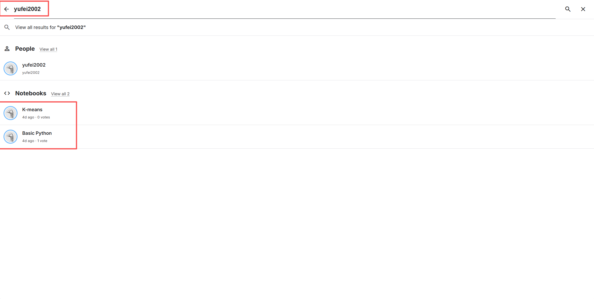
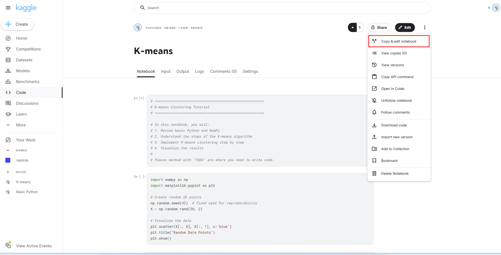
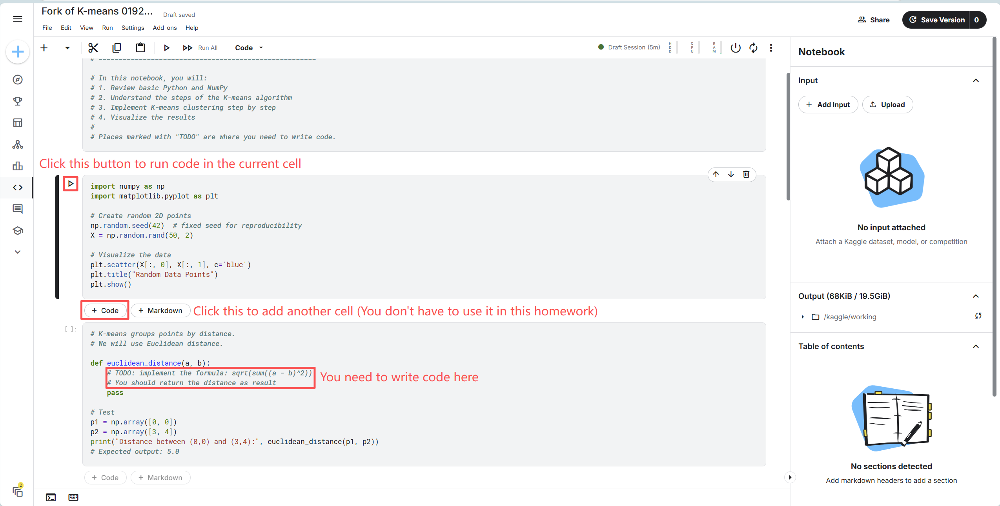
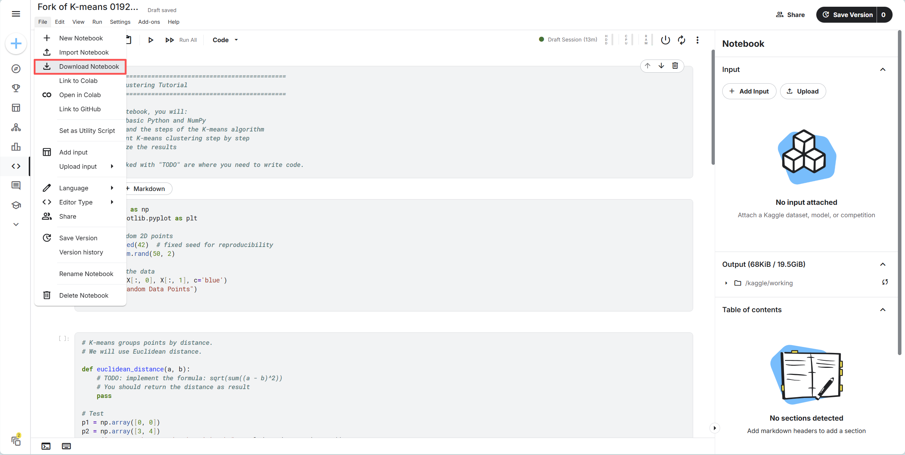

# Homework 1: K-means Clustering

##  Introduction
In this assignment, you will learn how to implement **K-means clustering** from scratch using Python.  
By the end of this assignment, you will be able to:

- Write simple Python functions

- Understand how Euclidean distance works

- Implement the main steps of the K-means algorithm

- Visualize the clustering results

---

##  Environment Setup
We recommend using **Kaggle Notebook** (no installation needed):  
 [Go to Notebook](https://www.kaggle.com/code)

Once you have signed up for Kaggle Notebooks, you can access the following links to learn about K-means clustering and practice coding:

 [Basic Python](https://www.kaggle.com/code/yufei2002/basic-python). This notebook provides a quick introduction to writing Python code. If you are already comfortable with Python, you may skip this part. (You don't need to hand in this notebook)

 [Kmeans Clustering](https://www.kaggle.com/code/yufei2002/k-means). This notebook walks you through the core steps of the K-means clustering algorithm. Follow the instructions and complete the code in the **TODO** sections. Please submit the completed notebook as your assignment.

---

## Assignment Submission

Please submit the following items:

1. Your completed Jupyter Notebook file (.ipynb).

2. A screenshot of your final clustering plot.

3. A Word document (.doc) containing answers to the following questions:

    * What happens when you increase K?

    * Why do centroids move during training?

Finally, compress all three files into a single .zip archive, named **yourname_studentID.zip**, and submit the archive.

---

## Appendix: How to Use Kaggle Notebook

This appendix will guide you through the process of using Kaggle Notebooks for your assignment.

1. Click the Link to Open the Assignment Notebook

    If you cannot open the link, you may try search for "yufei2002" in page https://www.kaggle.com/search, you will be able to find those 2 notebooks mentioned above.

    

2. Make Your Own Copy

    In the top-right corner, click “Copy & edit notebook”.

    

    This will create your own editable copy of the notebook under your Kaggle account.

    You can now run the code cells and edit the notebook freely.

3. Complete the Assignment

    Carefully read the instructions in the notebook.

    Fill in the code where you see # TODO.

    

    Run the notebook cell by cell to make sure your code works correctly.

4. Save and Download Your Notebook

    After finishing, click File → Download Notebook (.ipynb).

    This will download your notebook file to your computer (e.g., kmeans_assignment.ipynb).

    
